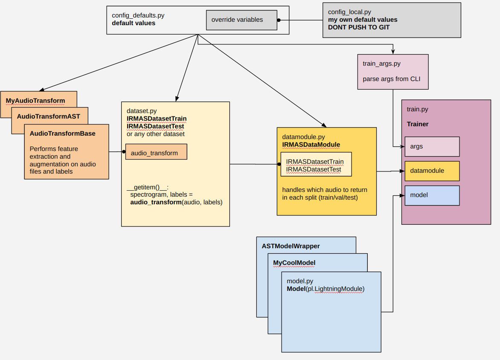
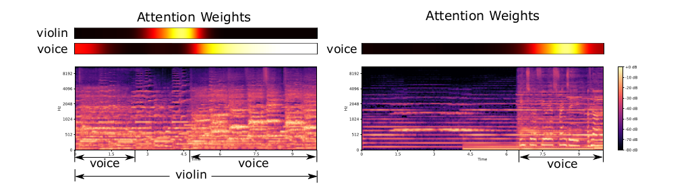
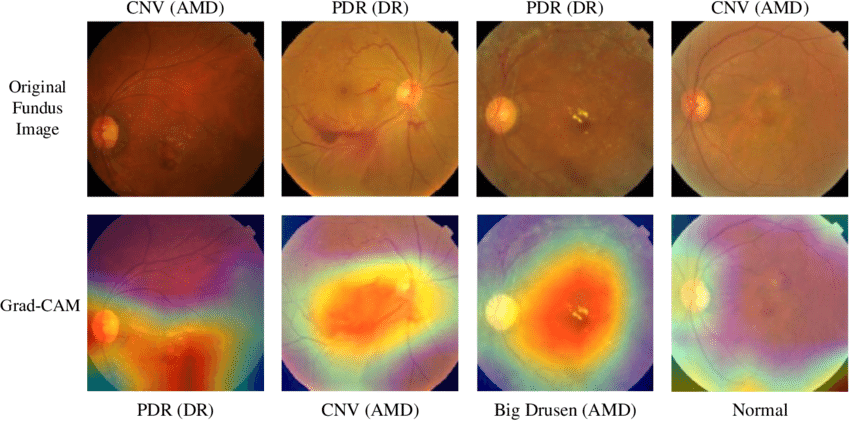
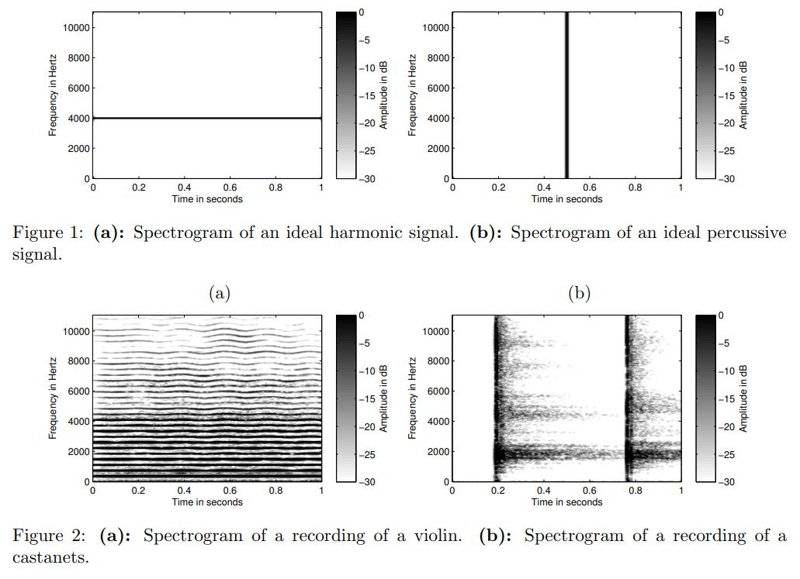

# 🎸 Lumen Data Science 2023 – Audio Classification

## Project Documentation

https://docs.google.com/document/d/18Ds27Myu1UrBoEp-s2LuY4JIwpjVKbguecgBt9dB3Jc/edit?usp=sharing

Experiments: https://docs.google.com/spreadsheets/d/1DK04mzl79wB_NNKNJFpf8HrG24TvEzwpreovirgSjGY/edit?usp=sharing

Check the code architecture drawing: https://docs.google.com/drawings/d/1DDG480MVKn_C3fZktl5t6uvWeh57Vx2wgtH9GJYsGAU/edit?usp=sharing




## Notes


Tasks:

- [x] check the assumption that label instrument is present thought the whole audio (check n=200 samples and check how many occourances)
  - holds up for most cases?
- [ ] create eval script which will caculate ALL metrics for the whole dataset
- [ ] add tripplet loss or (classification + perceptual distance)
- [ ] design an augmentation that we can use for progressive training
- [ ] use validation examples in train (without data leakage)
- [ ] try out focal loss, label smoothing
- [ ] implement saving the embeddings of each model for visualizations using dimensionality reduction

Low priority tasks:
- [ ] convert all augmentations so they happen on the GPU
- [ ] make sure augmetantions happen in batch
- [ ] attempt error analysis by looking where the gradients are large
- [ ] compare Mirko's wavelet transform with scipy's native transformation
  - run experiments in both cases
- [ ] reserach the BEATs model and incorporate it to the existing training structure as fast as possible so we get concrete results. BEATs links are down below.
- [ ] think about and reserach what happens with variable sampling rate and how can we avoid issues with time length change
- [ ] Label smoothing. We used label smoothing to account for noisy annotations and absence of birds in “unlucky” 30sec crops.
- [ ] add fluffy support for all models

Matej:

- [ ] download ESC50 non instrument audio files and write data loader which are NOT instruments (@matej)
- [ ] check for all models edge cases (0.1 sec, 2h)
- [ ] include Ivan's relabeled data and retrained some model to check performance boost (make sure to pick a model which already works)
- [ ] perform validation on Rep's corected dataset to check how many labels are correctly marked in the original dataset
  - check if all instruments are correct
  - check if at least one instrument is correct
- [ ] visualize embedded features for each model with tensorboard embedder
- [ ] use AST's features for tensorboard embedder https://projector.tensorflow.org/
- [ ] Low priortiy pretraning: SparK https://github.com/keyu-tian/SparK
- [ ] create random classifier
  - [ ] best accuracy = all zeros
  - [ ] best f1 = randomly mark 2-4 instruments as True
  - [ ] best recall = all ones

Mirko:
- [x] implement Fluffy nn.Module
- [x] use Fluffy on Torch CNN, multi-head
- [x] train some model Fluffy
- [x] Wav2Vec2 feature extractor only
- [ ] Train Wav2Vec2 Transformer "m3hrdadfi/wav2vec2-base-100k-gtzan-music-genres"
  - [ ] nothing better than simple CNN?
- [ ] Directly compare Fluffy to non. Fluffy (include metrics)
  - [ ] report your findings in Google Docs
- [ ] Train OpenMIC with Wav2Vec2 both
  - maybe
  - if Fluffy showed no improvement in previous step then don't use Fluffy
  - if Fluffy showed improvement train with Fluffy and no Fluffy
  - [ ] report your findings in Google Docs
- [ ] add new metric loss function inside `src/model/loss_function.py` and train model using it. Compare metrics.
  - [ ] report your findings in Google Docs
- [ ] add Contrastive loss from here https://kevinmusgrave.github.io/pytorch-metric-learning/losses/#contrastiveloss
  - [ ] report your findings in Google Docs
  - [ ] implement dataset anchor, positive and negative based on a given loss function, should work for all
    - [ ] how do you sample positive and negative? Is it uniform acorss dataset, uniform across classes or p=0.5 positive/negative
- [ ] add ArcFace loss and repeat everything for the above
  - [ ] report your findings in Google Docs
- [ ] create attention visualization
- 

Ivan:
- [ ] cleanup audio transform for spectrograms (remove repeat)
  - [ ] you still need to resize because the height isn't 224 (it's 128) but make sure the width is the same as the pretrained model image width
- [ ] move spectrogram chunking to collate. Use caculate_audio_max_seconds_for_image_width to dynamically determine the audio length.
- [ ] train  ResNeXt 50_32x4d on MelSpectrogram
  - [ ] Compare how augmentations affect the final metrics:
    - [ ] with no augmentations
    - [ ] with augmentations
- [ ] train  ResNeXt 50_32x4d on MFCC
  - [ ] Compare how augmentations affect the final metrics:
    - [ ] with no augmentations
    - [ ] with augmentations
- [ ] prototype pretraining phase:
  - Shuffle parts of the spectrogram in the following way: (16x16 grid)
    - shuffle 15% of patches
    - electra, is the patch shuffled?
- [ ] add gradient/activation visualization for a predicted image. Which parts of the image light up during inference?
- 
- [ ] implement spectrogram normalization and std (norm,std) and use those paramters to preprocess the image before training.

Vinko:
- [ ] research audio augmentations
- [ ] research classical audio features

Else
- audio features in the context of traditional approach => baseline

  - https://en.wikipedia.org/wiki/Mel-frequency_cepstrum

- use smaller CNN (efficient-v2-small, imagenet) for intial reporting

  - what's the spectrogram problem in the context of length variability
  - which augmentations do we use?
  - what are the methods for generating new audio files?

- Monolith (Kiklop) vs multi-head (Fluffy):

  - problem with multi-head: number of heads depends on the number of instruments
    - problem with Kiklop but it's manifseted in number of weights
  - Fluffy problem: class disbalans, what's the appropriate loss function. Will the training be stable?

## Setup

### Python Virtual Environment

Create and populate the [virtual environment](https://docs.python.org/3/library/venv.html#:~:text=A%20virtual%20environment%20is%20a,part%20of%20your%20operating%20system). Simply put, the virtual environment allows you to install Python packages for this project only (which you can easily delete later). This way, we won't clutter your global Python packages.

**Step 1: Execute the following command:**

```bash
python3 -m venv venv && source venv/bin/activate && pip install -r requirements.txt && pip install -r requirements-dev.txt
```

**Step 2: Install current directory as a editable Python module:**

```bash
pip install -e .
```

**(optional) Step 3: Activate pre-commit hook**

```
pre-commit install
```

Pre-commit, defined in `.pre-commit-config.yaml` will fix your imports will make sure the code follows Python standards

To remove pre-commit run: `rm -rf .git/hooks`

## 📁 Directory structure

| Directory                 | Description                                         |
| ------------------------- | --------------------------------------------------- |
| [data](data/)             | datasets                                            |
| [docs](docs/)             | documentation                                       |
| [figures](figures/)       | figures                                             |
| [models](models/)         | model checkpoints, model metadata, training reports |
| [references](references/) | research papers and competition guidelines          |
| [src](src/)               | python source code                                  |

## 📋 Notes

General links:

- Audio Deep Learning Made Simple State-of-the-Art Techniques:
  1. https://towardsdatascience.com/audio-deep-learning-made-simple-part-1-state-of-the-art-techniques-da1d3dff2504
  2. https://towardsdatascience.com/audio-deep-learning-made-simple-part-2-why-mel-spectrograms-perform-better-aad889a93505
  3. https://towardsdatascience.com/audio-deep-learning-made-simple-part-3-data-preparation-and-augmentation-24c6e1f6b52
- paperswithcode Audio Classification: https://paperswithcode.com/task/audio-classification
- Music and Instrument Classification using Deep Learning Technics: https://cs230.stanford.edu/projects_fall_2019/reports/26225883.pdf
- AUDIO MANIPULATION WITH TORCHAUDIO: https://pytorch.org/tutorials/beginner/audio_preprocessing_tutorial.html

### Irmas dataset issues

Use cleanlab to find bad lables: https://docs.cleanlab.ai/stable/tutorials/audio.html?highlight=encoderclassifier

### Train and validation dataset, move some validation examples to train

Do this without introducing data leakage, but make sure that we still have enough validation data.


### Resizing and chunking

Chunking should happen only in inference in the following way:
- preprocess 20sec audio normally, send the spectrogram to the model and chunk the spectrogram inside of the `predict_step`.

We don't do chunking in the train step because we can't chunk **the label**.

Time window of spectrogram is defined by maximum audio lenght of some train sample. If we chunk that sample, we don't know if the label will appear in every of those chunks.


### Visualizations

Add low dim (t-Sne) plot of features to check clusters. How to that:
- forward pass every example
- now you have embedding
- take t-sne

### Pretraining

Masked Autoencoders (MAE)


https://huggingface.co/docs/transformers/model_doc/vit_mae#transformers.ViTMAEForPreTraining

Has script for pretrain but does it work? Written in nn.Module
- https://github.com/YuanGongND/ssast

Pretraining on CNN-s:
- SparK: https://github.com/keyu-tian/SparK
- timm: https://github.com/huggingface/pytorch-image-models/tree/main/


### Adapter transformer training

Instead of training the transformer backbone, add layers in between the backbone and train those layers. Those layers are called adapters.

https://docs.adapterhub.ml/
https://docs.adapterhub.ml/adapter_composition.html
- parameter efficient tuninng (possible adapters): https://github.com/huggingface/peft


### Normalization

Normalization of the audio in time domain (amplitude). Librosa already does this?

Spectrogram normalization, same as any image problem normalization - pre-caculate mean and std and use it in the preprocessing step.

### 🎵 Datasets

IRMAS dataset https://www.upf.edu/web/mtg/irmas:

- IRMAS Test dataset only contains the information about presence of the instruments. Drums and music genre information is **not present**.
- examples:  6705
- instruments: 11
- duration: 3sec

NSynth: Neural Audio Synthesis https://magenta.tensorflow.org/datasets/nsynth

- examples: 305 979
- instruments: 1006
- A novel WaveNet-style autoencoder model that learns codes that meaningfully represent the space of instrument sounds.

MusicNet:

- examples: 330
- instruments: 11
- duration: song

MedleyDB:

- examples: 122
- instruments: 80

OpenMIC-2018 https://zenodo.org/record/1432913#.W6dPeJNKjOR

- paper: http://ismir2018.ircam.fr/doc/pdfs/248_Paper.pdf
- num examples: 20 000
- instruments: 20
- duration: 10sec


### Distance between classes

https://kevinmusgrave.github.io/pytorch-metric-learning/losses/
How to construct tripplets: https://omoindrot.github.io/triplet-loss
Softmax loss and center loss:
https://hav4ik.github.io/articles/deep-metric-learning-survey

Some instruments are similar and their class should be (somehow) close together.

Standard classification loss + (alpha * distance between two classes)
1. distance is probably embedings from some pretrained audio model (audio transformer)


Tripplet loss, how do we form triplets
1. real: guitar
2. postive: guitar
3. negative: not guitar?


### Audio which are not instruments

Reserach audio files which are NOT instruments. Both background noises and sounds SIMILAR to instruments! Download the datasets and write dataset loader for them (@matej). Label everything [0, ..., 0]

### 💡⚙️ Models and training

Problem: how to encode additional features (drums/no drums, music genre)? We can't create spectrogram out fo those arrays. Maybe simply append one hot encoded values after the spectrogram becomes 1D linear vector?

#### BEATs

Current state-of-the-art model for audio classification on multiple datasets and multiple metrics.

paper: https://arxiv.org/pdf/2212.09058.pdf
github: https://github.com/microsoft/unilm/tree/master/beats
https://paperswithcode.com/sota/audio-classification-on-audioset

#### AST

- github: https://github.com/YuanGongND/ast
- paper: https://arxiv.org/pdf/2104.01778.pdf
- pretrained model: https://huggingface.co/MIT/ast-finetuned-audioset-10-10-0.4593
- hugging face: https://huggingface.co/docs/transformers/model_doc/audio-spectrogram-transformer

AST max duration is 10.23 sec for 16_000hz audio

Notes:

- They used 16kHz audio for the pretrained model, so if you want to use the pretrained model, please prepare your data in 16kHz

Idea: introduce multiple MLP (fully conneted layer) heads. Each head will detect a single instrument instead of trying to detect all instruments at once.

- [ ] explore how to implement this in PyTorch efficiently:
  - https://ensemble-pytorch.readthedocs.io/en/latest/
  - https://pytorch.org/functorch/stable/notebooks/ensembling.html

Idea: train on single wav, then later introduce `irmas_combinatorics` dataset which contains multiple wav


#### LSTM and Melspectrograms (Mirko)
Trained LSTM (with and without Bahdanau attention) on melspectrogram and MFCC features, for single and multiple insturment classification.
Adding instruments accroding to genre and randomly was also explored. This approach retains high accuracy due to the class imbalance of the train and validation set, however the F1 metric, with macro averaging in the multi instrument case, remains low in the 0.26 - 0.35 interval. All instruments with higher F1 metrics __use__ Bahdanau attention.

#### LSTM and Wavelet (Mirko)
Aside from sliding wavelet filters, the output of the wavelet transform needs to be logsacled or preferably trasformed with `amplitude_to_db`. This does not seem to improve or degrade the performance of the LSTM model with attention, and the F1 score remains in similar margins.
Still doing some resarch on Wavelets April 3rd...


#### Adding instruments (Mirko :( )
~~Adding instrument waveforms to imitate the examples with multiple insturments needs to be handled with greater care, otherwise it only improves the F1 metric slightly (LSTM) or even lowers it (Wav2Vec2 backbone)~~. A bug was present that I did not catch before. I'm redoing the expereiments.

### Fluffy
The idea was to implement a pretrained feature extractor with multiple FCNN (but not necessarily FCNN) heads that serve as disconected binary instrument classifiers. E.g. we wan to classify 5 instruments, hence we use a backbone with 5 FCNNs, and each FCNN searches for it's "own" instrument among the 5.

#### Fluffy with Wav2Vec2 feature extractor backbone
As was already mentioned, we used only the feature extractor of the pretrained Wav2Vec2 model, and completely disposed of the transformer component for effiency. Up untill this point, the training was performed for ~35 epochs and while the average validation f1 metric remains in the 0.5-0.6 region, it varies significantly across instruments. For most instruments the f1 score remains in the 0.6-0.7 range with numerous outliers, on the high end we have the acoustic guitar and the human voice with f1 above 0.8. This is to be expected, considering the backbone was trained on many instances of human voices. On the low end we have the organ with f1 of ~0.2, and most likely due do bugs in the code the electric guitar with f1 of 0. This could also be atributed to it's similarity with other instruments such as violin or acoustic guitar. This leaves us with a "deathrattle" of sort for this whole "let's use only IRMAS" idea. The idea is to pretrain a feature extractor based on contrastive loss, aslo margins within genres and instrument families should be applied. If this doesn't produce better results the only solution I propose is getting more data, e.g. open MIC.

#### Fluffy with entire Wav2Vec2
This model has been trained for far fewer epochs ~7, and so far it exhibits the same issues as Fluffy with just the feature extractor. Perhaps more training would be needed, however using such large models requires considerable memory usage, and it's use durign __inference__ time might be limited.


#### SVM

Introduce SVM and train it additionally on high level features of spectrogram (MFCC). For example, one can caculate entropy of a audio/spectrogram for a given timeframe (@vinko)

If you have audio of 3 sec, caculate ~30 entropies every 0.1 sec and use those entropies as SVM features. Also try using a lot more librosa features.

#### ➕ Ensamble

Ensamble should be features of some backbone and Vinko's SVM.

### Audio knowledge

#### Harmonic and Percussive Sounds

https://www.audiolabs-erlangen.de/resources/MIR/FMP/C8/C8S1_HPS.html


Loosely speaking, a harmonic sound is what we perceive as pitched sound, what makes us hear melodies and chords. The prototype of a **harmonic** sound is the acoustic realization of a sinusoid, which corresponds to a **horizontal line in a spectrogram** representation. The sound of a violin is another typical example of what we consider a harmonic sound. Again, most of the observed structures in the spectrogram are of horizontal nature (even though they are intermingled with noise-like components). On the other hand, a percussive sound is what we perceive as a clash, a knock, a clap, or a click. The sound of a drum stroke or a transient that occurs in the attack phase of a musical tone are further typical examples. The prototype of a **percussive** sound is the acoustic realization of an impulse, which corresponds to a **vertical line in a spectrogram representation**.

### 🔊 Feature extraction

https://pytorch.org/audio/stable/transforms.html
https://pytorch.org/audio/stable/functional.html#feature-extractions

#### Spectrogram

note: in practice, Mel Spectrograms are used instead of classical spectrogram. We have to normazlie spectrograms images just like any other image dataset (mean/std).


https://www.physik.uzh.ch/local/teaching/SPI301/LV-2015-Help/lvanls.chm/STFT_Spectrogram_Core.html#:~:text=frequency%20bins%20specifies%20the%20FFT,The%20default%20is%20512.

Take an audio sequence and peform SFTF (Short-time Fourier transform) to get spectrums in multiple time intervals. The result is a 3D tensor (time, amplitude, spectrum). STFT has a time window size which is defined by a `sampling frequnecy`. It is also defined by a `window type`.

### Mel-Frequency Cepstral Coefficients (MFCC)

Spectrogram of Mel Spectrogram:

https://youtu.be/4_SH2nfbQZ8

### 🥴 Augmentations

- https://github.com/asteroid-team/torch-audiomentations
- https://github.com/iver56/audiomentations
- https://github.com/Spijkervet/torchaudio-augmentations


- https://pytorch.org/audio/main/tutorials/audio_feature_augmentation_tutorial.html#specaugment
- https://pytorch.org/audio/stable/transforms.html#augmentations
- https://pytorch.org/audio/stable/generated/torchaudio.sox_effects.effect_names.html#torchaudio.sox_effects.effect_names

#### Audio augmentations

- white noise
- time shift
- amplitude change / normalization

<details open>
<summary>PyTorch Sox effects</summary>

allpass, band, bandpass, bandreject, bass, bend, biquad, chorus, channels, compand, contrast, dcshift, deemph, delay, dither, divide, downsample, earwax, echo, echos, equalizer, fade, fir, firfit, flanger, gain, highpass, hilbert, loudness, lowpass, mcompand, norm, oops, overdrive, pad, phaser, pitch, rate, remix, repeat, reverb, reverse, riaa, silence, sinc, speed, stat, stats, stretch, swap, synth, tempo, treble, tremolo, trim, upsample, vad, vol

</details>

#### Spectrum augmentations

SpecAugment: https://ai.googleblog.com/2019/04/specaugment-new-data-augmentation.html
SpecAugment PyTorch: https://github.com/zcaceres/spec_augment
SpecAugment torchaudio: https://pytorch.org/audio/main/tutorials/audio_feature_augmentation_tutorial.html#specaugment

### 🔀 Data generation

Naive: concat multiple audio sequences into one and merge their labels. Introduce some overlapping, but not too much!

Use the same genre for data generation: combine sounds which come from the same genre instead of different genres

How to sample?

- sample audio files [3, 5] but dont use more than 4 instruments
- sample different starting positions at which the audio will start playing
  - START-----x---x----------x--------x----------END
- cutoff the audio sequence at max length?

### Torch, Librosa and Kaldi

Librosa and Torch give the same array (sound) if both are normalized and converted to mono.

Librosa is gives same array if you load it with sr=None, resample compared to resampling on load.

Best results for AST feature extraction, use torchaudio.load with resampling.


Kaldi

window_shift = int(sample_frequency * frame_shift * 0.001)
window_size = int(sample_frequency * frame_length * 0.001)


Librosa
hop_length
               #ms    #len
1/(1 / 44100 * 1000) * 20

with a 25ms Hamming window every 10ms (hop)

nfft = 1/(1 / 44100 * 1000) * 25
hop = 1/(1 / 44100 * 1000) * 10

### Web

https://github.com/janmyler/web-audio-editor

## Done tasks

Tasks:
- [x] write summary of Wavelet transform and how it affects the results
- [x] Wav2Vec results, and train
- [x] write summary of LSTM results
- [x] implement argument which accepts list of numbers [1000, 500, 4] and will create appropriate deep cnn
  - use module called deep head and pass it as a argument
- [x] finish experiments and interpretation of the wavelet transformation
- [x] implement spectrogram cropping and zero padding instead of resizing
- [x] implement SVM model which uses classical audio features for mutlilabel classification
  - [x] research if SVM can perform multilabel classification or use 11 SVMs
- [x] add more augmentations
- [x] check if wavelet works
- [x] implement chunking of the audio in inference and perform multiple forward pass
______________________________________________________________________

## 🏆 Team members

<table>
  <tr>
    <td align="center"><a href="https://github.com/VinkoGitHub"><br /><sub><b>Vinko Dragušica</b></sub><br /></td>
    <td align="center"><a href="https://github.com/mirxonius"><br /><sub><b>Filip Mirković</b></sub></a><br /></td>
   <td align="center"><a href="https://github.com/ir2718"><br /><sub><b>Ivan Rep</b></sub></a><br /></td>
    <td align="center"><a href="https://github.com/ciglenecki"><br /><sub><b>Matej Ciglenečki</b></sub></a><br /></td>
</table>
