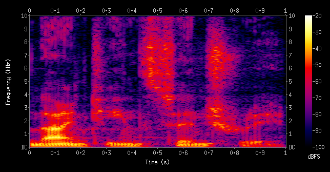

# 🎸 Lumen Data Science 2023 – Audio Classification

Check the code architecture drawing: https://docs.google.com/drawings/d/1DDG480MVKn_C3fZktl5t6uvWeh57Vx2wgtH9GJYsGAU/edit?usp=sharing


## Notes:

- todo: zapisati ideju, error analysis, gledati gdje su gradijenti veći (to je primjer teži)

- todo: zapisati ideju, napraviti eval skriptu koja će računati metrike za cijeli dataset

  - precision, f1, confusin matrica, najteži primjer, koliko smo fulali koji instrument...
  -

- todo (matej): fix dataset class extraction (one instrument has the same name as genre)

- todo matej: poslat vinku za klasicne znacajke

- data generation: use same genre for data generation (ako radimo nove zvukove koristiti zvukove iz žanrova)

  - pristupi za generiranje
  - \[x, x, x\] .wav
  - duljina audio skvence (3 - 5) # train -> | | | | |
  - broj instrumenta koji će pojaviti u sekvnci (2-4) uzeti samo iz istog žanra(?)
  - vremenski trenuci u kojima instrument počinje ^
    ______________________________________________________________________
    x  x      xx
    ______________________________________________________________________

- annotation: neki podaci u trainu imaju dodatne instrumente, treba proći filove i označiti instrumente koji se pojavljuju a nisu označeni

  - možda napraviti random sample od n=300 i provjeritit koji udio filoeva ima kirvo označene podatke
  - provjeritit što je s validacijskim podacima

- napraviti poseban model koji moze raspoznati znacjke, žanr i bubnjevi (oprez, ukupna veličina je ~2 veća)

  - (             ) => () distiling
  - kreni možda rađe od manjeg

- audio značajke u kontekstu SVM-a (klasične old school značajke) => baseline

  - https://en.wikipedia.org/wiki/Mel-frequency_cepstrum

- koristiti manji CNN (efficient-v2-small, imagenet) za brže prototipiranje značajki i augemtancije

  - kakav spektrogram (varijablinost duljine u kontestu CNN-a )
  - kakve augmetnacije
  - kakve metode generiranje novih audio podataka (audio preklapanja, audio konkartnacije)

- Monolith (Kiklop) vs multi-head (Fluffy / Hydra):

  - problem with multi-head: broj parametara ovisi o broju instrumenta. To vrijedi i za običan model koji nije multi-head ali ovom slučaju je taj problem naglašeniji jer dodajemo cijeli jedan FC umjesto jedan redak u matrici (neuron) u postojećem FC-u.
  - problem with multi-head: disbalanas klase, koja je dobra loss funckija i hoće li treniranje biti uspješno?
  - problem Kiklop: nužna augmentacija

- Normalizacija zvuka

  - normalizirati zvuk na po amplitudi (nekako??)
  - normalizirati spektrogram (isti postupak i klasična normalizacija slika)

- geneirranje spektrograma pomoću maskiranja (transformeri)

  - Masked Autoencoders Are Scalable Vision Learners: https://arxiv.org/abs/2111.06377

Matej: AST
Mirko: Fluffy modul za efficentv2/ast, valične pizdarije i te gluposti
Vinko: Augmetnacija, audio značajke u kontekstu SVM-a
Rep: re-labeliranje Label Studio (todo: matej, pripremiti podatke)

## Setup

### Python Virtual Environment

Create and populate the [virtual environment](https://docs.python.org/3/library/venv.html#:~:text=A%20virtual%20environment%20is%20a,part%20of%20your%20operating%20system). Simply put, the virtual environment allows you to install Python packages for this project only (which you can easily delete later). This way, we won't clutter your global Python packages.

**Step 1: Execute the following command:**

```bash
python3 -m venv venv && source venv/bin/activate && pip install -r requirements.txt && pip install -r requirements-dev.txt
```

**Step 2: Install current directory as a editable Python module:**

```bash
pip install -e .
```

**(optional) Step 3: Activate pre-commit hook**

```
pre-commit install
```

Pre-commit, defined in `.pre-commit-config.yaml` will fix your imports will make sure the code follows Python standards

To remove pre-commit run: `rm -rf .git/hooks`

## 📁 Directory structure

| Directory                 | Description                                         |
| ------------------------- | --------------------------------------------------- |
| [data](data/)             | datasets                                            |
| [docs](docs/)             | documentation                                       |
| [figures](figures/)       | figures                                             |
| [models](models/)         | model checkpoints, model metadata, training reports |
| [references](references/) | research papers and competition guidelines          |
| [src](src/)               | python source code                                  |

## 📋 Notes

General links:

- Audio Deep Learning Made Simple State-of-the-Art Techniques:
  1. https://towardsdatascience.com/audio-deep-learning-made-simple-part-1-state-of-the-art-techniques-da1d3dff2504
  2. https://towardsdatascience.com/audio-deep-learning-made-simple-part-2-why-mel-spectrograms-perform-better-aad889a93505
  3. https://towardsdatascience.com/audio-deep-learning-made-simple-part-3-data-preparation-and-augmentation-24c6e1f6b52
- paperswithcode Audio Classification: https://paperswithcode.com/task/audio-classification
- Music and Instrument Classification using Deep Learning Technics: https://cs230.stanford.edu/projects_fall_2019/reports/26225883.pdf
- AUDIO MANIPULATION WITH TORCHAUDIO: https://pytorch.org/tutorials/beginner/audio_preprocessing_tutorial.html

### 🎵 Datasets

IRMAS dataset https://www.upf.edu/web/mtg/irmas:

- IRMAS Test dataset only contains the information about presence of the instruments. Drums and music genre information is **not present**.
- examples:  6705
- instruments: 11
- duration: 3sec

NSynth: Neural Audio Synthesis https://magenta.tensorflow.org/datasets/nsynth

- examples: 305 979
- instruments: 1006
- A novel WaveNet-style autoencoder model that learns codes that meaningfully represent the space of instrument sounds.

MusicNet:

- examples: 330
- instruments: 11
- duration: song

MedleyDB:

- examples: 122
- instruments: 80

OpenMIC-2018 https://zenodo.org/record/1432913#.W6dPeJNKjOR

- paper: http://ismir2018.ircam.fr/doc/pdfs/248_Paper.pdf
- num examples: 20 000
- instruments: 20
- duration: 10sec

### 💡⚙️ Models and training

Problem: how to encode additional features (drums/no drums, music genre)? We can't create spectrogram out fo those arrays. Maybe simply append one hot encoded values after the spectrogram becomes 1D linear vector?

#### BEATs

Current state-of-the-art model for audio classification on multiple datasets and multiple metrics.

paper: https://arxiv.org/pdf/2212.09058.pdf
github: https://github.com/microsoft/unilm/tree/master/beats
https://paperswithcode.com/sota/audio-classification-on-audioset

#### AST

- github: https://github.com/YuanGongND/ast
- paper: https://arxiv.org/pdf/2104.01778.pdf
- pretrained model: https://huggingface.co/MIT/ast-finetuned-audioset-10-10-0.4593
- hugging face: https://huggingface.co/docs/transformers/model_doc/audio-spectrogram-transformer

Notes:

- They used 16kHz audio for the pretrained model, so if you want to use the pretrained model, please prepare your data in 16kHz

Idea: introduce multiple MLP (fully conneted layer) heads. Each head will detect a single instrument instead of trying to detect all instruments at once.

- [ ] explore how to implement this in PyTorch efficiently:
  - https://ensemble-pytorch.readthedocs.io/en/latest/
  - https://pytorch.org/functorch/stable/notebooks/ensembling.html

Idea: train on single wav, then later introduce `irmas_combinatorics` dataset which contains multiple wav

#### ➕ Ensamble

Introduce SVM and train it additionally on high level features of spectrogram. For example, one can caculate entropy of a spectrogram for a given timeframe.

### 🔊 Feature extraction

https://pytorch.org/audio/stable/transforms.html
https://pytorch.org/audio/stable/functional.html#feature-extractions

#### Spectrogram

note: in practice, Mel Spectrograms are used instead of classical spectrogram. We have to normazlie spectrograms images just like any other image dataset (mean/std).



https://www.physik.uzh.ch/local/teaching/SPI301/LV-2015-Help/lvanls.chm/STFT_Spectrogram_Core.html#:~:text=frequency%20bins%20specifies%20the%20FFT,The%20default%20is%20512.

Take an audio sequence and peform SFTF (Short-time Fourier transform) to get spectrums in multiple time intervals. The result is a 3D tensor (time, amplitude, spectrum). STFT has a time window size which is defined by a `sampling frequnecy`. It is also defined by a `window type`.

### 🥴 Augmentations

- https://pytorch.org/audio/main/tutorials/audio_feature_augmentation_tutorial.html#specaugment
- https://pytorch.org/audio/stable/transforms.html#augmentations
- https://pytorch.org/audio/stable/generated/torchaudio.sox_effects.effect_names.html#torchaudio.sox_effects.effect_names

#### Audio augmentations

- white noise
- time shift
- amplitude change / normalization

<details open>
<summary>PyTorch Sox effects</summary>

allpass, band, bandpass, bandreject, bass, bend, biquad, chorus, channels, compand, contrast, dcshift, deemph, delay, dither, divide, downsample, earwax, echo, echos, equalizer, fade, fir, firfit, flanger, gain, highpass, hilbert, loudness, lowpass, mcompand, norm, oops, overdrive, pad, phaser, pitch, rate, remix, repeat, reverb, reverse, riaa, silence, sinc, speed, stat, stats, stretch, swap, synth, tempo, treble, tremolo, trim, upsample, vad, vol

</details>

#### Spectrum augmentations

SpecAugment: https://ai.googleblog.com/2019/04/specaugment-new-data-augmentation.html
SpecAugment PyTorch: https://github.com/zcaceres/spec_augment
SpecAugment torchaudio: https://pytorch.org/audio/main/tutorials/audio_feature_augmentation_tutorial.html#specaugment

### 🔀 Data generation

Naive: concat multiple audio sequences into one and merge their labels. Introduce some overlapping, but not too much!

## 🏆 Team members

<table>
  <tr>
    <td align="center"><a href="https://github.com/VinkoGitHub"><br /><sub><b>Vinko Dragušica</b></sub><br /></td>
    <td align="center"><a href="https://github.com/mirxonius"><br /><sub><b>Filip Mirković</b></sub></a><br /></td>
   <td align="center"><a href="https://github.com/ir2718"><br /><sub><b>Ivan Rep</b></sub></a><br /></td>
    <td align="center"><a href="https://github.com/ciglenecki"><br /><sub><b>Matej Ciglenečki</b></sub></a><br /></td>
</table>
