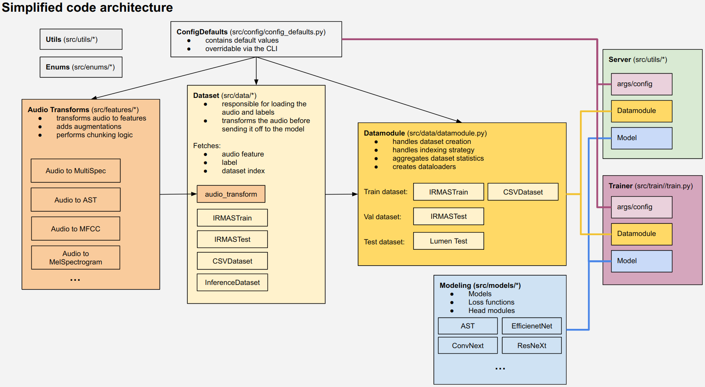
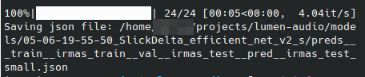
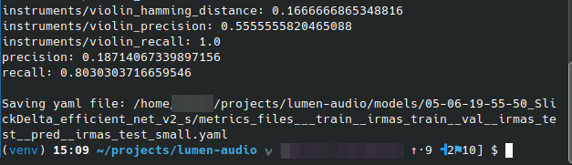
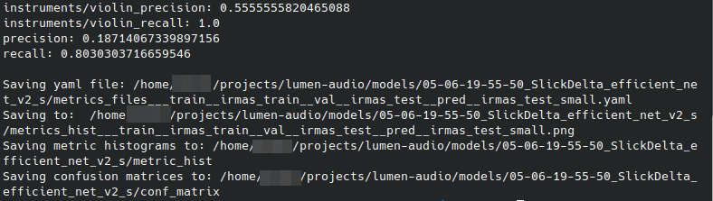
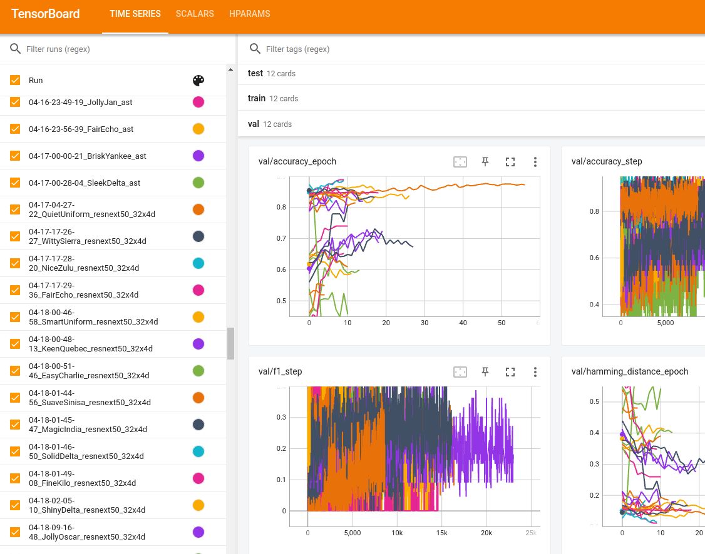

| Directory                | Description                       |
| ------------------------ | --------------------------------- |
| [data](data/)            | datasets and other data |
| [docs](docs/)            | documentation                     |
| [figures](figures/)      | figures                           |
| [models](models/)        | model checkpoints, model metadata |
| [src](src/)              | python source code                |
| [src/server](src/server/) | python server source code         |

> Note: Your current directory in CLI should be the root of this project directory.

# Source code architecture



# External dependecies

External dependencies we used (note that you don't need them for training and inference):

- FFmpeg: [https://ffmpeg.org/download.html](https://ffmpeg.org/download.html)

# Virtual Environment

Create and populate the [virtual environment](https://docs.python.org/3/library/venv.html#:~:text=A%20virtual%20environment%20is%20a,part%20of%20your%20operating%20system). Simply put, the virtual environment allows you to install Python packages for this project only (which you can easily delete later). This way, we won't clutter your global Python packages.

Choose one of two approachs to create the virtual environment:

## a) Venv

help: [https://docs.python.org/3/library/venv.html](https://docs.python.org/3/library/venv.html)

**Step 1: Create virtual env, activate it and install the packages:**

```bash
python3 -m venv venv
source venv/bin/activate
sleep 1
pip install -r requirements.txt
```

**Step 2: Install current directory as a editable Python module:**

```bash
pip install -e .
```

## b) Conda Virtual Environment

help: [https://conda.io/projects/conda/en/latest/user-guide/g#etting-started.html](https://conda.io/projects/conda/en/latest/user-guide/g#etting-started.html)

**Step 1: Create virtual env, activate it and install the packages:**

```bash
conda create --name lumen-env python==3.10
conda activate lumen-env
sleep 1
pip install -r requirements.txt
```

**Step 2: Install current directory as a editable Python module:**

```bash
pip install -e .
```

# Dataset setup

This project allows training and inference on multiple different datasets. Although you can specify the dataset to any directory, we suggest moving your datasets to `data` directory.

Datasets are almost always specified in the following format when using the CLI:

```bash
--train-paths <DATASET_DIR_TYPE_1>:<DATASET_PATH_1> <DATASET_DIR_TYPE_2>:<DATASET_PATH_2>
 e.g
--train-paths irmastrain:data/irmas/train csv:data/hello.csv
```

## Dataset directory types

> Each dataset directory type is a strategy for loading labels. `inference` dataset directory type doesn't load labels and it should be used for inference. Other dataset directory types (`irmastrain`, `irmastest` or `csv`) have built-in strategy which assign a label to audio. This is usually done by extracting the label from filename, .txt file or .csv columns.

## Dataset directory type: `inference`

`inference` is restricted only for inference. Use this dataset directory type if you want to infer labels without caculating metrics.

It accepts a directory where we recursively find all audio files:

```default
├── dataset
│   ├── file_1.wav
│   ├── file_2.wav
│   ├── subdir
│   │   │   ├── file_3.ogg
│   │   │   ├── file_4.ogg
│   │   │   ├── file_5.mp3
│   └── file_6.wav
```

`inference` also accepts a .csv file with the following structure:

| file               | ignored_col_1 | ignored_col_2 |
| ------------------ | ------------- | ------------- |
| dataset/483840.wav | "X"           | "X"           |
| dataset/3840.wav   | "X"           | "X"           |
| dataset/145920.wav | "X"           | "X"           |
| dataset/126720.wav | "X"           | "X"           |
| dataset/195840.wav | "X"           | "X"           |
| dataset/34560.wav  | "X"           | "X"           |
| dataset/226560.wav | "X"           | "X"           |

## Dataset directory type: `irmastrain`

This dataset directory type is used when you want to train IRMAS train-like directory. Subdirectories denote the instrument class.
Wav filename format:

- `<PREFIX>[<INSTRUMENT>][<DRUMS>][<GENRE>]<suffix>.wav.`
- `<PREFIX>[<INSTRUMENT>][<GENRE>]<suffix>.wav.`

Directory structure:
```txt
├── dataset
│   ├── cel
│   │   ├── 008__[cel][nod][cla]0058__1.wav
│   │   ├── 008__[cel][nod][cla]0058__2.wav
│   │   ├── 008__[cel][nod][cla]0058__3.wav
│   │   ├── 012__[cel][nod][cla]0043__1.wav
│   |   ├── ...
│   ├── cla
│   ...
│   └── voi
```

## Dataset directory type: `irmastest`

IRMAS test-like directory
Wav/label filename format:

- `<FILENAME>-<SONG_PART>.{wav,txt}`

Directory structure:

```default
├── dataset
│   ├── 0050_10CC___I_M_NOT_IN_LOVE-11.txt
│   ├── 0050_10CC___I_M_NOT_IN_LOVE-11.wav
│   ├── 0050_10CC___I_M_NOT_IN_LOVE-13.txt
│   ├── 0050_10CC___I_M_NOT_IN_LOVE-13.wav
│   ├── 0050_10CC___I_M_NOT_IN_LOVE-15.txt
│   ├── 0050_10CC___I_M_NOT_IN_LOVE-15.wav
│   ├── 0050_10CC___I_M_NOT_IN_LOVE-17.txt
```

Label file format:

```default
cel
gel
voi
```

## Dataset directory type: `csv`

CSV File structure:
`file` column contains audio filenames while other 11 columns denote the presence of the instrument in the audio file.

| file               | cel | cla | flu | gac | gel | org | pia | sax | tru | vio | voi |
| ------------------ | --- | --- | --- | --- | --- | --- | --- | --- | --- | --- | --- |
| dataset/483840.wav | 1   | 0   | 0   | 0   | 0   | 1   | 0   | 0   | 0   | 0   | 1   |
| dataset/3840.wav   | 0   | 1   | 0   | 0   | 0   | 0   | 0   | 0   | 0   | 0   | 1   |
| dataset/145920.wav | 0   | 1   | 0   | 0   | 0   | 0   | 0   | 0   | 0   | 0   | 1   |
| dataset/126720.wav | 0   | 0   | 0   | 0   | 0   | 0   | 1   | 0   | 0   | 0   | 0   |
| dataset/195840.wav | 0   | 0   | 1   | 0   | 0   | 0   | 1   | 0   | 0   | 0   | 0   |
| dataset/34560.wav  | 0   | 0   | 0   | 0   | 1   | 0   | 0   | 1   | 0   | 0   | 0   |
| dataset/226560.wav | 0   | 1   | 0   | 0   | 0   | 0   | 0   | 0   | 0   | 0   | 0   |

# Pretrained models

Although you can specify model directory path with `--path-models` we suggest moving your pretrained models to the `models/` directory. Pretrained models should end with `.ckpt` extension which differenciates them from other files in `models/` directory, such as .txt log files. Example of the usual model filename `models/04-20-15-52-55_experiment/checkpoints/04-20-15-52-55_experiment.ckpt`

Before moving on, please ensure that you have at least one `.ckpt` pretrained model in your `models` directory. `.ckpt` file can be in a nested directory.

# Testing and Inference

Testing: predict labels for a given model checkpoint and a given dataset and **caculate metrics** by comparing true label and predicted label

Inference: predict labels for a given model checkpoint and a given dataset

## a) Testing or Inference via REST API

Help text for `src/server/main.py`:


```txt
usage: main.py [--host str] [--hot-reload] [--device str] --model-dir Path [--batch-size int]
[--port int] [--num-workers int] [-h] [--add-instrument-metrics]

options:
-h, --help
  show this help message and exit

ConfigDefault ['Config arguments']:
--batch-size int
  (default: 4)
--num-workers int
  Number of workers (default: 4)

Script arguments:
--host str
  Server host. (default: localhost)
--device str
  The device to be used eg. cuda:0. (default: cuda:0)
--hot-reload
  Use hot reload which auto-restarts the server on code change(not recommanded).
  (default: False)
--model-dir Path
  Directory which to model checkpoints (.ckpt files) (default: None)
--port int
  Server port. (default: 8090)
--add-instrument-metrics
  Add instrument metrics to the response. This will increase number
  of items in API response size by (instrument count * number of metrics) (default: False)
```


Run the server:

```txt
python3 src/server/main.py --model-dir models/ --host localhost \
--port 8090 --batch-size 2 --num-workers 4 --add-instrument-metrics
```


Open [http://localhost:8090/docs](http://localhost:8090/docs) in browser.
Click `GET /models` and "Try it out" button


Click "Execute".


Copy paste the path of the model you want to use for testing or prediction.


Go to the `POST /model/predict-directory` section, fill out the request parameters and predict the dataset for a given model.


Check the respone body.


For testing it's use `POST /model/test-directory` and fill out the `dataset_type` parameter in the body with some of the following: [`irmastrain`, `irmastest`, `csv`]

## b) Inference via the Python script (`src/inference/run_test.py`)

It's also possible to use a python script to test and

```txt
usage: python3 src/inference/run_test.py [--batch-size int] [--ckpt [Path]] [--device str]
[--save-roc] [--out-dir Path] [--num-workers int] [-h] [--save-metric-hist] [--save-confusion]
[--dataset-paths [List]]

options:
-h, --help            show this help message and exit

ConfigDefault ['Config arguments']:
--batch-size int
  (default: 4)
--ckpt [Path]
  .ckpt file, automatically restores model, epoch, step, LR schedulers, etc... (default: None)
--num-workers int     Number of workers (default: 4)
--dataset-paths [List]
  Dataset path with the following format format:
  --dataset-paths inference:/path/to/dataset
                  openmic:/path/to/dataset
  (default: None)

Script arguments:
--device str          The device to be used eg. cuda:0. (default: cuda)
--save-roc            Caculate and save ROC for each instrument (default: False)
--out-dir Path        Sets the output directory (default: None)
--save-metric-hist    Caculate and save histogram for metrics (default: False)
--save-confusion      Caculate and save confusion matrices (default: False)
```

Inference example: script will infer labels and save them to JSON.

```bash
python3 src/train/run_test.py --dataset-paths data/irmas/test --ckpt models/model.ckpt \
--batch-size 1 --num-workers 1
```

{width=70%}

Testing example: script will infer labels and caculate get metrics for the `data/irmas/test` dataset

```bash
python3 src/train/run_test.py --dataset-paths irmastest:data/irmas/test \
--ckpt models/model.ckpt --batch-size 1 --num-workers 1
```

{width=70%}

Testing example with plots: script will infer labels and caculate get metrics for the `data/irmas/test` dataset and generate various plots for better model interpretation (distribution for each metric, confusion matrices for each instrument pair, metrics for each instrument, ROC curve)

```bash
python3 src/train/run_test.py --dataset-paths irmastest:data/irmas/test \
--ckpt models/model.ckpt --batch-size 1 --num-workers 1 --save-metric-hist \
--save-confusion --save-instrument-metrics --save-roc
```

{width=70%}

# Training

The list of possible train arguments is quite extensive which is why multiple training examples will be shown instead of describing every argument. To get a good feel of what's possible with `src/train/train.py` we suggest you check out the `ConfigDefault` class in `src/inference/run_test.py` file or run `python3 src/train/train.py -h` (you can ignore the `pl.Trainer` argument group).

You can stop the training anytime with `Ctrl + C`. Pressing it once will gracefully shutdown the training (and perform the testing phase). Pressing it twice shows more aggression, which will stop the training immediately.

Relevant enum values

```txt
AudioTransforms:  AST, MEL_SPECTROGRAM, MULTI_SPECTROGRAM, WAV2VEC, MFCC, WAVELET
                  MELCHROWAV
MetricMode: MIN, MAX
ModelInputDataType: WAVEFORM, IMAGE
OptimizeMetric: VAL_HAMMING, VAL_F1
SupportedAugmentations: CONCAT_N_SAMPLES, SUM_N_SAMPLES, BACKGROUND_NOISE
                        TIME_STRETCH, TIME_SHIFT, PITCH, COLOR_NOISE, TIMEINV
                        TIME_MASK, NORM_AFTER_TIME_AUGS, FREQ_MASK, RANDOM_ERASE,
                        RANDOM_PIXELS, SEVEN_BAND_EQ, CLIPPING, SUM_TWO_SAMPLES
SupportedDatasetDirType: irmastrain, irmastest, csv, inference, openmic
SupportedHeads: DEEP_HEAD, ATTENTION_HEAD
SupportedLossFunctions: CROSS_ENTROPY, CROSS_ENTROPY_POS_WEIGHT, FOCAL_LOSS,
                        FOCAL_LOSS_POS_WEIGHT, INSTRUMENT_FAMILY_LOSS
SupportedModels:  AST, EFFICIENT_NET_V2_S, EFFICIENT_NET_V2_M, EFFICIENT_NET_V2_L,
                  RESNEXT50_32X4D, RESNEXT101_32X8D, RESNEXT101_64X4D, WAV2VEC,
                  WAV2VEC_CNN, CONVNEXT_TINY, CONVNEXT_SMALL, CONVNEXT_LARGE,
                  CONVNEXT_BASE, MOBILENET_V3_LARGE, MOBNET
SupportedOptimizer: ADAM, ADAMW
SupportedScheduler: ONECYCLE, PLATEAU, AUTO_LR, COSINEANNEALING
```

Recommanded models are convolutional neural networks (`EFFICIENT_NET_V2_S`, `CONVNEXT_LARGE`, `MOBILENET_V3_LARGE`...) with `MEL_SPECTROGRAM` audio transform.

Minimal training example. Trains the whole model:

```bash
python3 src/train/train.py --train-paths irmastrain:data/irmas/train \
--val-paths irmastest:data/irmas/test --model CONVNEXT_TINY \
--audio-transform MEL_SPECTROGRAM --nofinetune-head
```

Quick training with reduced dataset and batch size:

```bash
python3 src/train/train.py --train-paths irmastrain:data/irmas/train \
--val-paths irmastest:data/irmas/test --model CONVNEXT_TINY \
--audio-transform MEL_SPECTROGRAM --nofinetune-head --quick
```

Quick training (reduces dataset size and limits batch size to 2):

```bash
python3 src/train/train.py --train-paths irmastrain:data/irmas/train \
--val-paths irmastest:data/irmas/test --model CONVNEXT_TINY \
--audio-transform MEL_SPECTROGRAM --nofinetune-head
```

Use less resources by setting `--batch-size 1 --num-workers 1`:

```bash
python3 src/train/train.py --train-paths irmastrain:data/irmas/train \
--val-paths irmastest:data/irmas/test --model CONVNEXT_TINY \
--audio-transform MEL_SPECTROGRAM --nofinetune-head --batch-size 1 --num-workers 1
```

Train only the head of the model:

```bash
python3 src/train/train.py --train-paths irmastrain:data/irmas/train \
--val-paths irmastest:data/irmas/test --model CONVNEXT_TINY --audio-transform MEL_SPECTROGRAM \
--head-after classifier --backbone-after classifier
```

Train the head for 5 epochs and then unfreeze the backbone from `layer3.2` onwards:

```bash
python3 src/train/train.py --train-paths irmastrain:data/irmas/train \
--val-paths irmastest:data/irmas/test --model CONVNEXT_TINY \
--audio-transform MEL_SPECTROGRAM --head-after classifier --finetune_head_epochs 5 \
-backbone-after layer3.2
```

Same as previous command with explicit learning rates. Learning rate changes through time in the following order (--lr-warmup -> --lr -> --lr-onecycle-max -> --lr -> 0):

```bash
python3 src/train/train.py --model CONVNEXT_TINY --audio-transform MEL_SPECTROGRAM \
--head-after classifier --finetune_head_epochs 5 \
--backbone-after layer3.2 --lr-warmup 5e-5 --lr 1e-5 --lr-onecycle-max 1e-4
```

Add augmentations to training:

```bash
# you can add --aug-kwargs which overrides augmentation kwargs
# (e.g. --aug-kwargs stretch_factors=0.9,1.1 freq_mask_param=50 sum_n_samples=3)
python3 src/train/train.py --train-paths irmastrain:data/irmas/train \
--val-paths irmastest:data/irmas/test --model CONVNEXT_TINY \
--audio-transform MEL_SPECTROGRAM --augmentations TIME_STRETCH TIME_SHIFT PITCH FREQ_MASK
```

Override early stopping metric:

```bash
python3 src/train/train.py --train-paths irmastrain:data/irmas/train \
--val-paths irmastest:data/irmas/test --model CONVNEXT_TINY \
--audio-transform MEL_SPECTROGRAM --metric VAL_F1 --metric-mode MAX
```

To list all arguments please run `python3 src/train/train.py -h`.

## Training logs

During the training, the script will create the directory inside `models/05-08-15-11-31_experiment_name` with the following structure:

```txt
├── checkpoints
│   └── my_model.ckpt # model checkpoint
├── config.yaml       # configuration
├── events.out.tfevents.1683558698.43a642fdf66e.1976756.0
├── hparams.yaml      # model hparams (pytorch lightning)
├── log.txt           # full log file
└── metrics.csv       # metrics in .csv format
```

# Tensorboard logs

Tensorboard logging is enabled by default. To see training and validation logs, run the command bellow. Logs should be available in a browser at `http://localhost:6006/`. For more options, check `tensorboard -h`.

```bash
tensorboard --port 6006 --logdir models/
```


