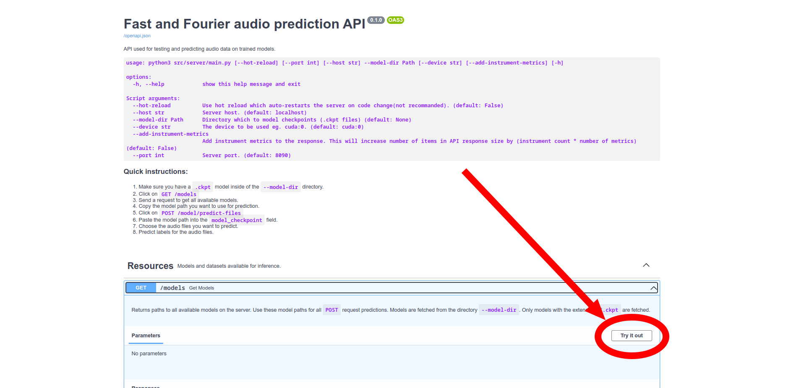

# Technical documentation

# TODO: conda

| Directory                | Description                       |
| ------------------------ | --------------------------------- |
| [data](data/)            | dataset, csvs, country shapefiles |
| [docs](docs/)            | documentation                     |
| [figures](figures/)      | figures                           |
| [models](models/)        | model checkpoints, model metadata |
| [src](src/)              | python source code                |
| [src/server](src/server) | python server source code         |

> Note: Your current directory in CLI should be the root of this project directory.

# 0. External dependecies

External dependencies we used (note that you don't need them for training and inference):
- FFmpeg: https://ffmpeg.org/download.html

# 1. Python Virtual Environment

Create and populate the [virtual environment](https://docs.python.org/3/library/venv.html#:~:text=A%20virtual%20environment%20is%20a,part%20of%20your%20operating%20system). Simply put, the virtual environment allows you to install Python packages for this project only (which you can easily delete later). This way, we won't clutter your global Python packages.

**Step 1: Execute the following command:**

Works :
```bash
python3 -m venv venv --prompt $(basename "$PWD")
source venv/bin/activate
sleep 1
pip install -r requirements.txt
```

**Step 2: Install current directory as a editable Python module:**

```bash
pip install -e .
```

# 2. Dataset setup

This project allows training and predicting on multiple different datasets. Although you can specify the dataset to any directory, we suggest moving your datasets to `data` directory.

Datasets are almost always specified in the following format when using the CLI:
```
--train-paths <DATASET_DIR_TYPE_1>:<DATASET_PATH_1> <DATASET_DIR_TYPE_2>:<DATASET_PATH_2>

# e.g
--train-paths irmastrain:data/irmas/train csv:data/hello.csv
```
## Dataset directory types

> Each dataset directory type is a strategy for loading labels. `inference` dataset directory type doesn't load labels and it should be used for inference. Other dataset directory types (`irmastrain`, `irmastest` or `csv`) have built-in strategy which assign a label to audio. This is usually done by extracting the label from filename, .txt file or .csv columns.

### `inference`
`inference` is restricted only for inference. Use this dataset directory type if you want to infer labels without caculating metrics.

It accepts a directory where we recursively find all audio files:
```default
├── dataset
│   ├── file_1.wav
│   ├── file_2.wav
│   ├── subdir
│   │   │   ├── file_3.ogg
│   │   │   ├── file_4.ogg
│   │   │   ├── file_5.mp3
│   └── file_6.wav
```
It can also accept a .csv file with the following structure:
| file               | ignored_col_1 | ignored_col_2 |
| ------------------ | ------------- | ------------- |
| dataset/483840.wav | "X"           | "X"           |
| dataset/3840.wav   | "X"           | "X"           |
| dataset/145920.wav | "X"           | "X"           |
| dataset/126720.wav | "X"           | "X"           |
| dataset/195840.wav | "X"           | "X"           |
| dataset/34560.wav  | "X"           | "X"           |
| dataset/226560.wav | "X"           | "X"           |

### `irmastrain`

Useful if you want to train IRMAS train-like directory. Subdirectories denote the instrument class.
Wav filename format:
- `<PREFIX>[<INSTRUMENT>][<DRUMS>][<GENRE>]<suffix>.wav.`
- `<PREFIX>[<INSTRUMENT>][<GENRE>]<suffix>.wav.`

```
├── dataset
│   ├── cel
│   │   ├── 008__[cel][nod][cla]0058__1.wav
│   │   ├── 008__[cel][nod][cla]0058__2.wav
│   │   ├── 008__[cel][nod][cla]0058__3.wav
│   │   ├── 012__[cel][nod][cla]0043__1.wav
│   |   ├── ...
│   ├── cla
│   ...
│   └── voi
```

### `irmastest`

IRMAS test-like directory
Wav/label filename format:
- `<PREFIX>[<INSTRUMENT>][<DRUMS>][<GENRE>]<suffix>.wav.`
- `<PREFIX>[<INSTRUMENT>][<GENRE>]<suffix>.wav.`

Label file format:
```
cel
gel
voi
```
Directory structure:
```
├── dataset
│   ├── 008__[cel][nod][cla]0058__1.wav
│   ├── 008__[cel][nod][cla]0058__1.txt
│   ├── 008__[cel][nod][cla]0058__2.wav
│   ├── 008__[cel][nod][cla]0058__2.txt
│   ├── 008__[cel][nod][cla]0058__3.wav
│   ├── 008__[cel][nod][cla]0058__3.txt
│   ├── 012__[cel][nod][cla]0043__1.wav
│   ├── 012__[cel][nod][cla]0043__1.txt
│   ├── ...
```


### `csv`

CSV File structure:
`file` column contains audio filenames while other 11 columns denote the presence of the instrument in the audio file.
| file               | cel | cla | flu | gac | gel | org | pia | sax | tru | vio | voi |
| ------------------ | --- | --- | --- | --- | --- | --- | --- | --- | --- | --- | --- |
| dataset/483840.wav | 1   | 0   | 0   | 0   | 0   | 1   | 0   | 0   | 0   | 0   | 1   |
| dataset/3840.wav   | 0   | 1   | 0   | 0   | 0   | 0   | 0   | 0   | 0   | 0   | 1   |
| dataset/145920.wav | 0   | 1   | 0   | 0   | 0   | 0   | 0   | 0   | 0   | 0   | 1   |
| dataset/126720.wav | 0   | 0   | 0   | 0   | 0   | 0   | 1   | 0   | 0   | 0   | 0   |
| dataset/195840.wav | 0   | 0   | 1   | 0   | 0   | 0   | 1   | 0   | 0   | 0   | 0   |
| dataset/34560.wav  | 0   | 0   | 0   | 0   | 1   | 0   | 0   | 1   | 0   | 0   | 0   |
| dataset/226560.wav | 0   | 1   | 0   | 0   | 0   | 0   | 0   | 0   | 0   | 0   | 0   |

# 3. Pretrained models

Although you can specify model directory path with `--path-models` we suggest moving your pretrained models to the `models/` directory. Pretrained models should end with `.ckpt` extension which differenciates them from other files in `models/` directory, such as .txt log files. Example of the usual model filename `models/04-20-15-52-55_TidyEcho_efficient_net_v2_m/checkpoints/04-20-15-52-55_TidyEcho_efficient_net_v2_m.ckpt`

Before moving on, please ensure that you have at least one `.ckpt` pretrained model in your `models` directory. `.ckpt` file can be in a nested directory.

# 4. Testing and Inference

Testing: predict labels for a given model checkpoint and a given dataset and **caculate metrics** by comparing true label and predicted label

Inference: predict labels for a given model checkpoint and a given dataset

## 4 a) Testing or Inference via REST API

Help text for `src/server/main.py`:
```
usage: main.py [--host str] [--hot-reload] [--device str] --model-dir Path [--batch-size int] [--port int] [--num-workers int] [-h] [--add-instrument-metrics]

options:
  -h, --help            show this help message and exit

ConfigDefault ['Config arguments']:
  --batch-size int      (default: 4)
  --num-workers int     Number of workers (default: 4)

Script arguments:
  --host str            Server host. (default: localhost)
  --device str          The device to be used eg. cuda:0. (default: cuda:0)
  --hot-reload          Use hot reload which auto-restarts the server on code change(not recommanded). (default: False)
  --model-dir Path      Directory which to model checkpoints (.ckpt files) (default: None)
  --port int            Server port. (default: 8090)
  --add-instrument-metrics
                        Add instrument metrics to the response. This will increase number of items in API response size by (instrument count * number of metrics) (default: False)
```
1. Run the server:
   ```
   python3 src/server/main.py --model-dir models/ --host localhost --port 8090 --batch-size 2 --num-workers 4 --add-instrument-metrics
   ```
2. Open http://localhost:8090/docs in browser
3. Click `GET /models` and "Try it out" button 
4. Click "Execute" 
5. Copy paste the path of the model you want to use for testing or prediction 
6. Go to the `POST /model/predict-directory` section, fill out the request parameters and predict the dataset for a given model
7. Check the respone body: 

For testing it's use `POST /model/test-directory` and fill out the `dataset_type` parameter in the body with some of the following: [`irmastrain`, `irmastest`, `csv`]

## 4 b) Inference via the Python script (`src/inference/run_test.py`)

It's also possible to use a python script to test and

```
usage: python3 src/inference/run_test.py [--save-confusion] [-h] [--save-roc] [--save-metric-hist] [--device str] [--relative-save-path None] [--dataset-paths [List]] [--ckpt [Path]]

options:
  -h, --help            show this help message and exit

ConfigDefault ['Config arguments']:
  --ckpt [Path]         .ckpt file, automatically restores model, epoch, step, LR schedulers, etc... (default: None)
  --dataset-paths [List]
                        Dataset path with the following format format: --dataset-paths inference:/path/to/dataset openmic:/path/to/dataset (default: None)

Script arguments:
  --save-confusion      Caculate and save confusion matrices (default: False)
  --save-roc            Caculate and save ROC for each instrument (default: False)
  --save-metric-hist    Caculate and save histogram for metrics (default: False)
  --device str          The device to be used eg. cuda:0. (default: cuda)
  --relative-save-path None
                        Output directory that's relative to the path of the checkpoint (default: None)
```

python3 src/train/run_test.py --dataset-paths irmastest:data/irmas/test_sum3 --ckpt models/05-08-11-38-04_SlickDelta_ast_astfiliteredhead-irmas-audioset/checkpoints/05-08-11-38-04_SlickDelta_ast_astfiliteredhead-irmas-audioset_val_acc_0.3742_val_loss_0.3504.ckpt --batch-size 1 --num-workers 1

## Training
After you prepared new dataset structure, you can start the _quick version_ of training:
```sh
python3 src/train.py --dataset-dirs data/dataset_external_subset/ data/dataset_original_subset/ \
--csv-rich-static data/dataset_complete_subset/data_rich_static__spacing_0.7_classes_31.csv \
--quick
```

You can stop the training anytime with `Ctrl + C`. Pressing it once will gracefully shutdown the training (and perform the testing phase). Pressing it twice shows more aggression, which will stop the training immediately.

### Development
**Code formating and pre-commit hook**

```
pip install -r requirements-dev.txt
pre-commit install
```

Pre-commit, defined in `.pre-commit-config.yaml` will fix your imports will make sure the code follows Python standards

To remove pre-commit run: `rm -rf .git/hooks`
